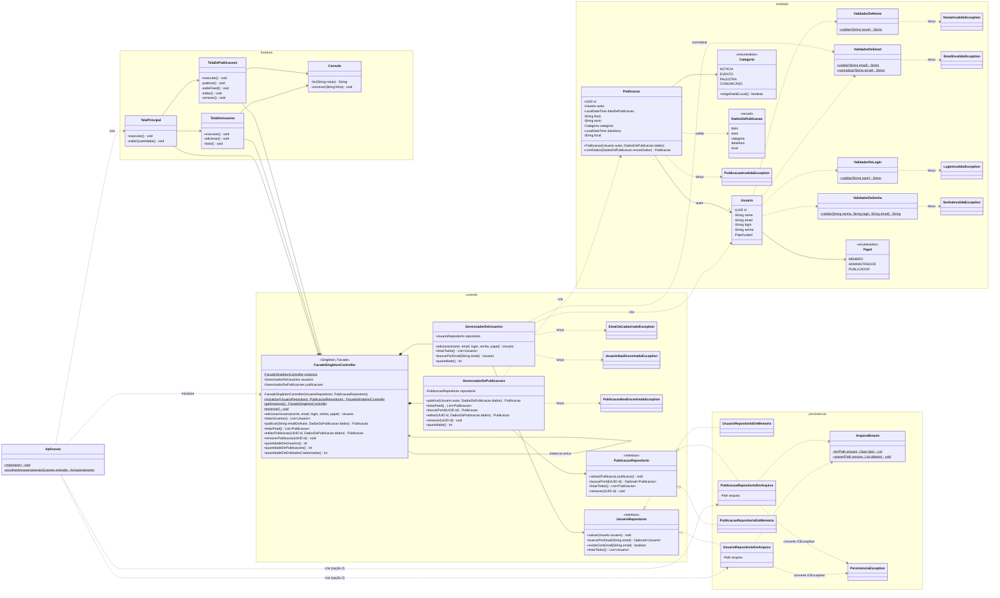

# Projeto detalhado — pacotes, classes de projeto e padrões

> Diferente do diagrama de **análise** ([`05-analise.md`](05-analise.md)), que é conceitual e muda pouco, o diagrama de classes de **projeto** reflete o código e é atualizado em toda sprint (ver [cronograma](00-entregas.md)).

## 1. Divisão de pacotes

```text
src/main/java/informaci/
├── Aplicacao.java         ← ponto de entrada: pergunta o armazenamento, monta os repositórios
│                            e inicializa a fachada
├── fronteira/             ← telas de console (TelaPrincipal, TelaDeUsuarios, TelaDePublicacoes)
├── controle/              ← fachada única (FacadeSingletonController), gerentes dos casos de uso
│                            (GerenciadorDeUsuarios, GerenciadorDePublicacoes), contratos dos
│                            repositórios e exceções de regra de negócio
├── entidade/              ← Usuario, Papel, Publicacao, Categoria, DadosDaPublicacao,
│                            validadores (nome, e-mail, login, senha) e exceções de validação
└── persistencia/          ← implementações dos repositórios (memória e arquivo binário),
                             ArquivoBinario e PersistenciaException
src/test/java/informaci/   ← mesma estrutura; testes JUnit por cenário das specs
```

| Pacote do projeto | Camada sugerida pela disciplina |
|---|---|
| `fronteira` | `ui` |
| `controle`, `entidade` | `business` (`control`, `model`, `exception`) |
| `persistencia` | `infra` |

**Regra de dependência:** `fronteira` → `controle` → `entidade` ← `persistencia`. As interfaces `UsuarioRepositorio` e `PublicacaoRepositorio` foram declaradas em `controle`, e não em `persistencia`: assim as regras de negócio não importam nenhuma classe de armazenamento, e é a persistência que depende delas (NF-MAN-01, [ADR-0001](07-arquitetura/adr/0001-persistencia-substituivel.md)). A fronteira conversa apenas com a `FacadeSingletonController` ([ADR-0002](07-arquitetura/adr/0002-fachada-unica.md)). Só `Aplicacao` conhece todas as camadas, porque é ela que escolhe a implementação.

## 2. Diagrama de classes de projeto

### Estado atual: Sprint 3

Acrescenta à Sprint 2 o CRUD de `Publicacao`, entidade relacionada a `Usuario` (o autor, com papel Publicador), e a fachada única `FacadeSingletonController` (Facade + Singleton), com o método que retorna a quantidade de entidades cadastradas.


```mermaid
classDiagram
    direction LR

    class Aplicacao {
        +main(args)$ void
        -escolherArmazenamento(Scanner entrada)$ Armazenamento
    }

    namespace fronteira {
        class TelaPrincipal {
            +executar() void
            -exibirQuantidade() void
        }
        class TelaDeUsuarios {
            +executar() void
            -adicionar() void
            -listar() void
        }
        class TelaDePublicacoes {
            +executar() void
            -publicar() void
            -exibirFeed() void
            -editar() void
            -remover() void
        }
        class Console {
            ~ler(String rotulo) String
            ~escrever(String linha) void
        }
    }

    namespace controle {
        class FacadeSingletonController {
            <<Singleton, Facade>>
            -FacadeSingletonController instancia$
            -GerenciadorDeUsuarios usuarios
            -GerenciadorDePublicacoes publicacoes
            -FacadeSingletonController(UsuarioRepositorio, PublicacaoRepositorio)
            +inicializar(UsuarioRepositorio, PublicacaoRepositorio)$ FacadeSingletonController
            +getInstancia()$ FacadeSingletonController
            +encerrar()$ void
            +adicionarUsuario(nome, email, login, senha, papel) Usuario
            +listarUsuarios() List~Usuario~
            +publicar(String emailDoAutor, DadosDaPublicacao dados) Publicacao
            +listarFeed() List~Publicacao~
            +editarPublicacao(UUID id, DadosDaPublicacao dados) Publicacao
            +removerPublicacao(UUID id) void
            +quantidadeDeUsuarios() int
            +quantidadeDePublicacoes() int
            +quantidadeDeEntidadesCadastradas() int
        }
        class GerenciadorDeUsuarios {
            -UsuarioRepositorio repositorio
            +adicionar(nome, email, login, senha, papel) Usuario
            +listarTodos() List~Usuario~
            +buscarPorEmail(String email) Usuario
            +quantidade() int
        }
        class GerenciadorDePublicacoes {
            -PublicacaoRepositorio repositorio
            +publicar(Usuario autor, DadosDaPublicacao dados) Publicacao
            +listarFeed() List~Publicacao~
            +buscarPorId(UUID id) Publicacao
            +editar(UUID id, DadosDaPublicacao dados) Publicacao
            +remover(UUID id) void
            +quantidade() int
        }
        class UsuarioRepositorio {
            <<interface>>
            +salvar(Usuario usuario) void
            +buscarPorEmail(String email) Optional~Usuario~
            +existeComEmail(String email) boolean
            +listarTodos() List~Usuario~
        }
        class PublicacaoRepositorio {
            <<interface>>
            +salvar(Publicacao publicacao) void
            +buscarPorId(UUID id) Optional~Publicacao~
            +listarTodas() List~Publicacao~
            +remover(UUID id) void
        }
        class EmailJaCadastradoException
        class UsuarioNaoEncontradoException
        class PublicacaoNaoEncontradaException
    }

    namespace entidade {
        class Usuario {
            -UUID id
            -String nome
            -String email
            -String login
            -String senha
            -Papel papel
        }
        class ValidadorDeNome {
            +validar(String nome)$ String
        }
        class ValidadorDeEmail {
            +validar(String email)$ String
            +normalizar(String email)$ String
        }
        class ValidadorDeLogin {
            +validar(String login)$ String
        }
        class ValidadorDeSenha {
            +validar(String senha, String login, String email)$ String
        }
        class Papel {
            <<enumeration>>
            MEMBRO
            ADMINISTRADOR
            PUBLICADOR
        }
        class Publicacao {
            -UUID id
            -Usuario autor
            -LocalDateTime dataDePublicacao
            -String titulo
            -String texto
            -Categoria categoria
            -LocalDateTime dataHora
            -String local
            +Publicacao(Usuario autor, DadosDaPublicacao dados)
            +comDados(DadosDaPublicacao novosDados) Publicacao
        }
        class Categoria {
            <<enumeration>>
            NOTICIA
            EVENTO
            PALESTRA
            COMUNICADO
            +exigeDataELocal() boolean
        }
        class DadosDaPublicacao {
            <<record>>
            titulo
            texto
            categoria
            dataHora
            local
        }
        class NomeInvalidoException
        class EmailInvalidoException
        class LoginInvalidoException
        class SenhaInvalidaException
        class PublicacaoInvalidaException
    }

    namespace persistencia {
        class UsuarioRepositorioEmMemoria
        class UsuarioRepositorioEmArquivo {
            -Path arquivo
        }
        class PublicacaoRepositorioEmMemoria
        class PublicacaoRepositorioEmArquivo {
            -Path arquivo
        }
        class ArquivoBinario {
            ~ler(Path arquivo, Class tipo)$ List
            ~gravar(Path arquivo, List objetos)$ void
        }
        class PersistenciaException
    }

    Aplicacao ..> FacadeSingletonController : inicializa
    Aplicacao ..> TelaPrincipal : cria
    Aplicacao ..> UsuarioRepositorioEmArquivo : cria (opção 2)
    Aplicacao ..> PublicacaoRepositorioEmArquivo : cria (opção 2)

    TelaPrincipal --> TelaDeUsuarios
    TelaPrincipal --> TelaDePublicacoes
    TelaPrincipal --> FacadeSingletonController
    TelaDeUsuarios --> FacadeSingletonController
    TelaDePublicacoes --> FacadeSingletonController
    TelaDeUsuarios --> Console
    TelaDePublicacoes --> Console

    FacadeSingletonController --> FacadeSingletonController : instancia única
    FacadeSingletonController *-- GerenciadorDeUsuarios
    FacadeSingletonController *-- GerenciadorDePublicacoes
    GerenciadorDeUsuarios --> UsuarioRepositorio
    GerenciadorDePublicacoes --> PublicacaoRepositorio
    GerenciadorDeUsuarios ..> Usuario : cria
    GerenciadorDePublicacoes ..> Publicacao : cria

    Usuario --> Papel
    Publicacao "*" --> "1" Usuario : autor
    Publicacao --> Categoria
    Publicacao ..> DadosDaPublicacao : valida

    UsuarioRepositorio <|.. UsuarioRepositorioEmMemoria
    UsuarioRepositorio <|.. UsuarioRepositorioEmArquivo
    PublicacaoRepositorio <|.. PublicacaoRepositorioEmMemoria
    PublicacaoRepositorio <|.. PublicacaoRepositorioEmArquivo
    UsuarioRepositorioEmArquivo ..> ArquivoBinario
    PublicacaoRepositorioEmArquivo ..> ArquivoBinario

    Usuario ..> ValidadorDeNome
    Usuario ..> ValidadorDeEmail
    Usuario ..> ValidadorDeLogin
    Usuario ..> ValidadorDeSenha
    GerenciadorDeUsuarios ..> ValidadorDeEmail : normalizar
    ValidadorDeNome ..> NomeInvalidoException : lança
    ValidadorDeEmail ..> EmailInvalidoException : lança
    ValidadorDeLogin ..> LoginInvalidoException : lança
    ValidadorDeSenha ..> SenhaInvalidaException : lança
    Publicacao ..> PublicacaoInvalidaException : lança
    GerenciadorDeUsuarios ..> EmailJaCadastradoException : lança
    GerenciadorDeUsuarios ..> UsuarioNaoEncontradoException : lança
    GerenciadorDePublicacoes ..> PublicacaoNaoEncontradaException : lança
    UsuarioRepositorioEmArquivo ..> PersistenciaException : converte IOException
    PublicacaoRepositorioEmArquivo ..> PersistenciaException : converte IOException
```

> Para não poluir o diagrama, as superclasses das exceções foram omitidas: `NomeInvalidoException`, `EmailInvalidoException`, `LoginInvalidoException`, `SenhaInvalidaException` e `PublicacaoInvalidaException` estendem `IllegalArgumentException`; as demais estendem `RuntimeException`.

**Tratamento das exceções** (`TelaDeUsuarios` e `TelaDePublicacoes`): cada exceção vira uma mensagem para o usuário, e o sistema continua em execução (NF-USA-01, NF-CON-01).

| Exceção | Lançada por | Mensagem exibida |
|---|---|---|
| `NomeInvalidoException` | `ValidadorDeNome` (RF01) | "Não foi possível adicionar: …" |
| `EmailInvalidoException` | `ValidadorDeEmail` (RF01) | "Não foi possível adicionar: …" |
| `LoginInvalidoException` | `ValidadorDeLogin` (RF02) | "Login inválido: …" |
| `SenhaInvalidaException` | `ValidadorDeSenha` (RF03) | "Senha inválida: …" |
| `EmailJaCadastradoException` | `GerenciadorDeUsuarios` (RF01) | "Não foi possível adicionar: …" |
| `PublicacaoInvalidaException` | `Publicacao` | "Publicação inválida: …" |
| `UsuarioNaoEncontradoException` | `GerenciadorDeUsuarios` (autor da publicação) | "Não foi possível publicar: …" |
| `PublicacaoNaoEncontradaException` | `GerenciadorDePublicacoes` | "Não foi possível editar: …" / "Não foi possível remover: …" |
| `PersistenciaException` | repositórios em arquivo | Ao gravar: "Falha ao armazenar …". Ao ler, na inicialização: a mensagem é exibida e `Aplicacao` pergunta de novo o armazenamento. Se a gravação falhar, a cópia em memória volta ao estado anterior |

## 3. Padrões de projeto utilizados

Preencha uma linha por padrão aplicado. Cada padrão relevante também tem um ADR.

| Padrão | Sprint | Classes participantes (papel no padrão) | Problema que resolve no projeto | ADR |
|---|---|---|---|---|
| Singleton | S3 | `FacadeSingletonController` (Singleton: construtor privado, `instancia` estática, `inicializar` e `getInstancia`) | Garante que todas as telas usem os mesmos gerentes e os mesmos dados. Como o armazenamento só é escolhido ao iniciar, a instância é criada por `inicializar` e não de forma preguiçosa | [ADR-0002](07-arquitetura/adr/0002-fachada-unica.md) |
| Facade | S3 | `FacadeSingletonController` (fachada); `GerenciadorDeUsuarios`, `GerenciadorDePublicacoes` (subsistema); `TelaPrincipal`, `TelaDeUsuarios`, `TelaDePublicacoes` (clientes) | A fronteira depende de uma única classe da camada de negócio, que também combina gerentes quando a operação envolve duas entidades (publicar em nome de um usuário, contar as entidades cadastradas) | [ADR-0002](07-arquitetura/adr/0002-fachada-unica.md) |
| Repository | S4 | | | |
| Factory Method / Abstract Factory | S4 | | | |
| Adapter | S4 | | | |
| Template Method | S4 | | | |
| Command | S5 | | | |
| Memento | S5 | | | |

## 4. Rastreabilidade cenário → teste

Todo cenário de RF01 a RF04 é verificado por pelo menos um teste automatizado (NF-MAN-02).

| Requisito · cenário | Testes |
|---|---|
| RF01 · Cadastro válido | `GerenciadorDeUsuariosTest.deve_adicionar_usuario_quando_dados_sao_validos`, `TelaDeUsuariosTest.deve_adicionar_usuario_quando_dados_sao_validos` |
| RF01 · E-mail já cadastrado | `GerenciadorDeUsuariosTest.deve_rejeitar_email_duplicado_que_difere_apenas_por_maiusculas`, `nao_deve_persistir_usuario_quando_email_esta_duplicado`, `TelaDeUsuariosTest.deve_exibir_mensagem_quando_email_ja_esta_cadastrado` |
| RF01 · E-mail em formato inválido | `UsuarioTest.deve_rejeitar_quando_email_nao_tem_arroba`, `deve_rejeitar_quando_email_nao_tem_dominio` |
| RF01 · Nome vazio | `UsuarioTest.deve_rejeitar_quando_nome_esta_em_branco` |
| RF02 · Login vazio | `UsuarioTest.deve_rejeitar_quando_login_esta_vazio`, `deve_rejeitar_quando_login_esta_em_branco` |
| RF02 · Login com mais de 12 caracteres | `UsuarioTest.deve_rejeitar_quando_login_tem_mais_de_12_caracteres` |
| RF02 · Login com exatamente 12 caracteres | `UsuarioTest.deve_aceitar_login_com_exatamente_12_caracteres` |
| RF02 · Login com números | `UsuarioTest.deve_rejeitar_quando_login_tem_numeros`, `TelaDeUsuariosTest.deve_exibir_mensagem_quando_login_e_invalido` |
| RF03 · Senha vazia | `UsuarioTest.deve_rejeitar_quando_senha_esta_vazia` |
| RF03 · Senha curta | `UsuarioTest.deve_rejeitar_quando_senha_tem_menos_de_8_caracteres` |
| RF03 · Senha longa | `UsuarioTest.deve_rejeitar_quando_senha_tem_mais_de_128_caracteres` |
| RF03 · Senha com poucos tipos de caractere | `UsuarioTest.deve_rejeitar_quando_senha_tem_apenas_um_tipo_de_caractere`, `deve_rejeitar_quando_senha_tem_apenas_dois_tipos_de_caractere` |
| RF03 · Senha com três tipos de caractere | `UsuarioTest.deve_aceitar_senha_com_tres_tipos_de_caractere` |
| RF03 · Senha igual ao login | `UsuarioTest.deve_rejeitar_quando_senha_e_igual_ao_login` |
| RF03 · Senha igual ao e-mail | `UsuarioTest.deve_rejeitar_quando_senha_e_igual_ao_email` |
| RF04 · Listagem com usuários | `GerenciadorDeUsuariosTest.deve_listar_todos_os_usuarios_cadastrados`, `TelaDeUsuariosTest.deve_listar_os_usuarios_cadastrados` |
| RF04 · Nenhum usuário | `TelaDeUsuariosTest.deve_informar_quando_nao_ha_usuarios_cadastrados` |
| NF-SEG-01 · Senha nunca exibida | `UsuarioTest.nao_deve_expor_a_senha_na_representacao_textual` |
| NF-CON-01 · Falha de armazenamento | `UsuarioRepositorioEmArquivoTest.deve_lancar_persistencia_exception_quando_nao_consegue_gravar`, `deve_lancar_persistencia_exception_quando_arquivo_esta_corrompido` |
| NF-CON-02 · Dados preservados | `UsuarioRepositorioEmArquivoTest.deve_manter_os_usuarios_apos_reabrir_o_repositorio` |
